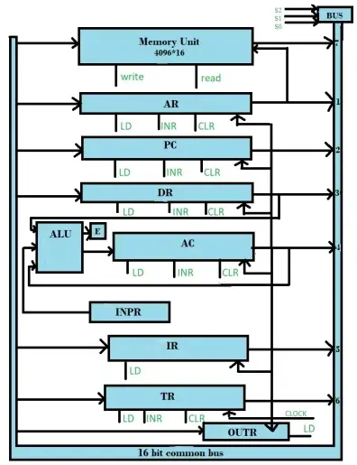

\begin{center}
    \Large{ Assignment 1}
\end{center}

\tableofcontents

\vspace{1cm}

## __Question 1__

1. __Differentiate between “hit” and “miss” with respect to cache memory.__

    A cache hit is when the data is in the cache and a cache miss is when the data
    is not in the cache.

1. __How interrupts are handled? Explain.__

    An interrupt is a signal to the processor emitted by hardware or software indicating an event that needs immediate attention. The processor responds by suspending its current activities, saving its state, and executing a function called an interrupt handler (or an interrupt service routine, or an ISR) to deal with the event. This interruption is temporary, and, after the interrupt handler finishes, the processor resumes normal activities.

1. __Explain little endian and big endian data storage mechanisms.__

    In little endian, the least significant byte is stored at the lowest address. In big endian, the most significant byte is stored at the lowest address.

1. __Express $A*B+(B*D+C\; \wedge  E)$ into reverse polish notation.__

    $A B *B D* C E \wedge + +$

1. __Differentiate between direct and indirect instruction.__

    In direct addressing, the operand is specified in the instruction itself. In indirect addressing, the operand is specified by the contents of a register.

    In direct addressing, the operand is specified in the instruction itself. In indirect addressing, the operand is specified by the contents of a register.

    For example, in the instruction `MOV R1, R2`, the operand is specified in the instruction itself. In the instruction `MOV R1, (R2)`, the operand is specified by the contents of the register `R2`.

1. __Briefly list the types of interrupts with the help of suitable examples.__

     - __Hardware Interrupts:__ The interrupt signal generated from external devices and i/o devices are made interrupt to CPU when the instructions are ready.
  
        For example − In a keyboard if we press a key to do some action this pressing of the keyboard generates a signal that is given to the processor to do action, such interrupts are called hardware interrupts.

        Hardware interrupts are classified into two types which are as follows −

       - Maskable Interrupt − The hardware interrupts that can be delayed when a highest priority interrupt has occurred to the processor.
       - Non Maskable Interrupt − The hardware that cannot be delayed and immediately be serviced by the processor.

     - __Software Interrupts:__ The interrupt signal generated from internal devices and software programs need to access any system call then software interrupts are present.
  
        Software interrupt is divided into two types. They are as follows −
          - Normal Interrupts − The interrupts that are caused by the software instructions are called software instructions.
          - Exception − Exception is nothing but an unplanned interruption while executing a program. For example − while executing a program if we got a value that is divided by zero is called an exception.

1. __Differentiate between RISC and CISC.__
     \newline

    | RISC | CISC |
    |------|------|
    |- Reduced Instruction Set Computer | Complex Instruction Set Computer |
    |- A large number of instructions are present in the architecture. | Very few instructions are present. The number of instructions is generally less than 100.|
    |- Some instructions with long execution times. These include instructions that copy an entire block from one part of memory to another and others that copy multiple registers to and from memory.| No instruction with a long execution time due to a very simple instruction set. Some early RISC machines did not even have an integer multiply instruction, requiring compilers to implement multiplication as a sequence of additions.|
    |- Variable-length encodings of the instructions.     ___Example___: IA32 instruction size can range from 1 to 15 bytes.| Fixed-length encodings of the instructions are used.     __Example__: In IA32, generally all instructions are encoded as 4 bytes.|
    |- Multiple formats are supported for specifying operands. A memory operand specifier can have many different combinations of displacement, base, and index register.| Simple addressing formats are supported. Only base and displacement addressing is allowed.|
    |- CISC supports array. |RISC does not support an array.|
    |- Arithmetic and logical operations can be applied to both memory and register operands.| Arithmetic and logical operations only use register operands. Memory referencing is only allowed by loading and storing instructions, i.e. reading from memory into a register and writing from a register to memory respectively.|
    |- Implementation programs are hidden from machine-level programs. The ISA provides a clean abstraction between programs and how they get executed.| Implementation programs exposed to machine-level programs. Few RISC machines do not allow specific instruction sequences.|
    |- Condition codes are used.| No condition codes are used.|
    |- The stack is being used for procedure arguments and returns addresses.| Registers are being used for procedure arguments and return addresses. Memory references can be avoided by some procedures.|

1. __Explain updating techniques used in cache design.__

    - __Write-through:__ In write-through, the data is written to both the cache and the main memory. This is the simplest method of updating the cache. It is also the fastest method of updating the cache. However, it is the least efficient method of updating the cache. This is because the data is written to both the cache and the main memory. This increases the number of memory accesses and hence the number of memory cycles.

    - __Write-back:__ In write-back, the data is written to the cache only. The data is written to the main memory only when the cache block is replaced. This is the most efficient method of updating the cache. However, it is the slowest method of updating the cache. This is because the data is written to the main memory only when the cache block is replaced. This increases the number of cache misses and hence the number of memory cycles.

    - __Write-allocate:__ In write-allocate, the data is written to the cache only. The data is written to the main memory only when the cache block is replaced. This is the most efficient method of updating the cache. However, it is the slowest method of updating the cache. This is because the data is written to the main memory only when the cache block is replaced. This increases the number of cache misses and hence the number of memory cycles.

    - __Write-around:__ In write-around, the data is written to the main memory only. The data is not written to the cache. This is the least efficient method of updating the cache. However, it is the fastest method of updating the cache. This is because the data is written to the main memory only. This reduces the number of memory accesses and hence the number of memory cycles.
  
    - __Write-protect:__ In write-protect, the data is written to the cache only. The data is not written to the main memory. This is the second most efficient method of updating the cache. However, it is the second fastest method of updating the cache. This is because the data is written to the cache only. This reduces the number of memory accesses and hence the number of memory cycles.

1. __Explain Virtual memory. Also state “Locality of Reference” principle.__

    Virtual memory is a memory management technique that allows a computer to execute programs that are larger than the physical memory available. It does so by using a portion of the hard disk as virtual memory. The operating system swaps out portions of the program that are not currently being used to the hard disk and swaps them back in when they are needed.

    By doing this, the degree of multiprogramming will be increased and therefore, the CPU utilization will also be increased.

    The locality of reference principle states that a program tends to access the same memory locations repeatedly. This is because the program is accessing the same data structures repeatedly. The locality of reference principle is used to implement virtual memory. The operating system uses the locality of reference principle to determine which portions of the program to swap out to the hard disk.

1. __What are different kinds of operations used in CPU design?__

    - __Arithmetic and Logic Operations:__ These operations are used to perform arithmetic and logical operations on the data. These operations are used to perform arithmetic and logical operations on the data. These operations are used to perform arithmetic and logical operations on the data. These operations are used to perform arithmetic and logical operations on the data.

    - __Data Transfer Operations:__ These operations are used to transfer data between the registers and the memory. These operations are used to transfer data between the registers and the memory. These operations are used to transfer data between the registers and the memory. These operations are used to transfer data between the registers and the memory.

    - __Control Operations:__ These operations are used to control the flow of the program.

## __Question 2:__

1. __Starting from initial value `R = 0b11011101`, determine the sequence of binary values in R after a logical shift left, followed by a circular shift right, followed by a logical shift right and a circular shift.__

    - Logical Shift Left: `R = 0b11011101` → `R = 0b10111010`

    - Circular Shift Right: `R = 0b10111010` → `R = 0b11011101`

    - Logical Shift Right: `R = 0b11011101` → `R = 0b01101110`

    - Circular Shift Left: `R = 0b01101110` → `R = 0b11011101`

1. __Draw and explain the common bus system for the simple computer. Also, draw the various registers, types of bus (eg. Data bus, control bus, address bus and where they are being used). Also, explain LOAD, Selection and Fetch of data in those registers using appropriate diagram.__

    The common bus is required in the computer for communication with registers and memory to decrease the hardware complexity.

    The basic computer has eight registers, a memory unit and control unit. The path is required to transfer data, address and control signal. If there is a wire for every operation and every address of memory location, then it will be excessive. So common bus system is implemented through use of MUX and other circuit for proper implementation of wire.

    |    Registers|Function|
    |-|-|
    |Instructions Registers (IR)|Hold instruction code of instruction currently executing|
    |Address Registers (AR)|All memory references are initiated by loading the memory address in AR|
    |Temporary Registers (TR)|Extra registers used to store data and address|
    |Input Registers (IR)|Hold the data from input devices|
    |Output Registers (OR)|Hold the data to send to output devices|
    |Program Counter (PC)|Holds the address of next instruction to be executed|
    |Accumulator (AC)|Store results produced by system|
    |Data Registers (DR)|Temporarily store data being transmitted to or from peripheral devices|

    \pagebreak

    {width=50%}

    Three control lines $S_2$, $S_1$, $S_0$ control which registers the bus selects as its input. Either one of the registers will have its load signal activated, or the memory will have its read signal activated.

    |$S_2$|$S_1$|$S_0$|Function|
    |-|-|-|-|
    |0|0|0|x|
    |0|0|1|Load AR|
    |0|1|0|Load PC|
    |0|1|1|Load DR|
    |1|0|0|Load AC|
    |1|0|1|Load IR|
    |1|1|0|Load TR|
    |1|1|1|Memory|

    - Six registers and a memory are connected to a bus.
    - The input register INPR and OUTR HAS 8 bit each.
    - The seven registers, memory, INPR, and OUTR are driven by a single phase clock pulse.
    - The particular register whose load (LD) input is enabled receives the data from the bus during the next clock pulse.
    - Five registers have three control inputs: load(LD), Increment(INR), and clear(CLR). Two registers IR and OUTR have only LD inputs.
    - The result is transferred to AC and end carry is transferred to flip-flop E.

## __Question 3__

1. __Convert the decimal 61.5867 into its binary equivalent.__

    $61.5867_{10} = 111101.100101100011000_2$

1. __Convert -6,75 (written in decimal) to floating point representation (single precision).__

    $-6.75_{10} = -110.11_2$

1. __What do you mean by bus arbitration? Explain serial and parallel bus arbitration in
detail.__

    - A device that initiates data transfers on the bus at any given time is called a bus master.

    - In a computer system, there may be more than one bus master such as a DMA controller or a processor etc.

    - These devices share the system bus and when a current master bus relinquishes another bus can acquire the control of the processor.

    - Bus arbitration is a process by which next device becomes the bus controller by transferring bus mastership to another bus.

    There are two types of bus arbitration:

   - Centralized bus arbitration  
  
        A single bus arbiter performs the required arbitration.

        There are three arbitration schemes which run on centralized arbitration.

        - Daisy Chaining − It is a simple and cheaper method where all the masters use the same line for making bus requests.

        - Polling Method − In this method, the controller is used to generate address lines for the master. For example, if there are 8 masters connected in a system at least 3 address lines are required.

        - Independent Request − In this scheme, each bus has its own bus request and a grant. The built-in priority decoder selects the highest priority requests and asserts the system.

   - Distributed bus arbitration
  
        - All devices participating in the selection of the next bus master.

        - Here, all the devices participate in the selection of the next bus master.

        - Each device on the bus is assigned a4 bit identification number.

        - When one or more devices request control of the bus, they assert the start arbitration signal and place their 4-bit identification numbers on arbitration lines through ARB3.

        - Each device compares the code and changes its bit position accordingly.

        - It does so by placing a 0 at the input of their drive.

        - The distributed arbitration is highly reliable because the bus operations are not dependant on devices.

    Arbitration techinques can also be classified as:

   - Static Arbitration Techniques
  
        In this technique, the priority assigned is fixed.

        It has two types.

        - Serial Arbitration

            It is also known as Daisy chain Arbitration. It is obtained by the daisy-chain connection of bus arbitration circuits. The scheme got the term from the structure of the grant line, which chains through each device from the higher to lowest priority. The highest priority device will pass the grant line to the lower priority device only if it does not want it. Then the priority is forwarded to the next in the sequence. All devices use the same line for bus requests.If a busy bus line returns to its idle state, the most high-priority arbiter enables the busy line, and its corresponding processor can then run the required bus transfer.

            Advantage
            - It is a simple design.
            - Less number control lines are used.

            Disadvantage
            - Priority depends on the physical location of the device
            - Propagation delay due to serially granting of bus
            - Failure of one of the devices may fail the entire system
            - Cannot assure fairness- a low priority device may be locked out indefinitely

        - Parallel Arbitration
  
            It uses an external priority encoder and decoder. Each bus arbiter has a bus request output line and a bus acknowledge input line. Each arbiter enables request lines when its processor is requesting the system bus. The one with the highest priority determined by the output of the decoder gets access to the bus.

   - Dynamic Arbitration Techniques

        Serial and Parallel bus arbitration are static since the priorities assigned are fixed. In dynamic arbitration, priorities of the system change while the system is in operation.

        The various algorithms used are:-

        - Time Slice

            It allocates a fixed-length time slice of bus time offered sequentially to each process in a round-robin fashion. The service provided by each system component and the system is independent of its location near the bus.
        - Polling

            In polling, the controller generates the addresses for the devices. The number of address lines needed depends upon the number of connected devices to the system. The controller generates a sequence of device addresses in response to the bus request. When the requesting device recognizes its address, it activates the busy bus line and uses the bus. After several bus cycles, the polling process continues by choosing a different processor. The polling sequence usually is programmable, and as a result, the selection priority can be altered under program control.

1. __Explain instruction cycle(fetch) and (decode) in detail. Also explain the working of computer registers used in it.__
